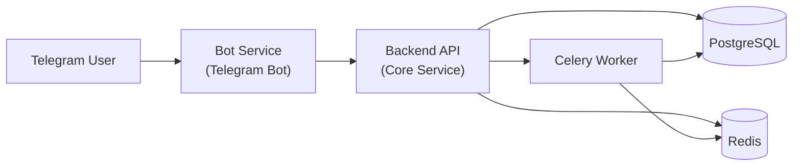

```mermaid
flowchart LR

User["Telegram User"]

Bot["Bot Service\n(Telegram Bot)"]
API["Backend API\n(Core Service)"]
DB[(PostgreSQL)]
Cache[(Redis)]
Worker["Celery Worker"]

User --> Bot
Bot --> API

API --> DB
API --> Cache

API --> Worker
Worker --> DB
Worker --> Cache
```