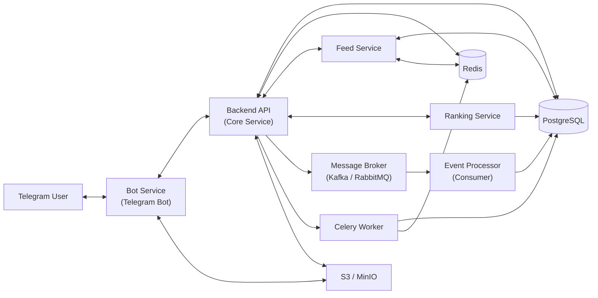

```mermaid
flowchart LR

User["Telegram User"]

Bot["Bot Service\n(Telegram Bot)"]
API["Backend API\n(Core Service)"]

DB[(PostgreSQL)]
Cache[(Redis)]

Worker["Celery Worker"]
Queue["Message Broker\n(Kafka / RabbitMQ)"]

EventService["Event Processor\n(Consumer)"]
Ranking["Ranking Service"]
Feed["Feed Service"]

Storage["S3 / MinIO"]

User <--> Bot
Bot <--> API

API <--> DB
API <--> Cache

API <--> Feed
Feed <--> DB
Feed <--> Cache

API <--> Ranking
Ranking --> DB

API --> Queue
Queue --> EventService
EventService --> DB

API --> Worker
Worker --> DB
Worker --> Cache

API <--> Storage
Bot <--> Storage
```