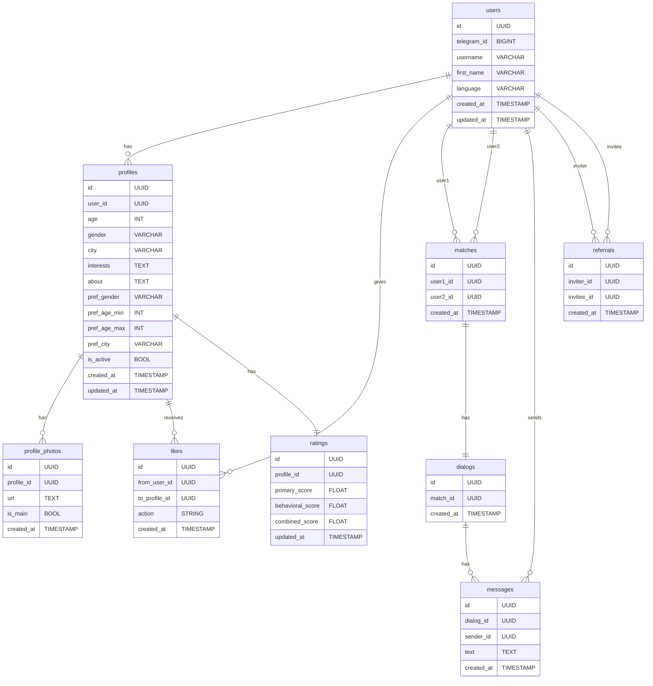

```mermaid
erDiagram

users {
  id UUID
  telegram_id BIGINT
  username VARCHAR
  first_name VARCHAR
  language VARCHAR
  created_at TIMESTAMP
  updated_at TIMESTAMP
}

profiles {
  id UUID
  user_id UUID
  age INT
  gender VARCHAR
  city VARCHAR
  interests TEXT
  about TEXT
  pref_gender VARCHAR
  pref_age_min INT
  pref_age_max INT
  pref_city VARCHAR
  is_active BOOL
  created_at TIMESTAMP
  updated_at TIMESTAMP
}

profile_photos {
  id UUID
  profile_id UUID
  url TEXT
  is_main BOOL
  created_at TIMESTAMP
}

likes {
  id UUID
  from_user_id UUID
  to_profile_id UUID
  action STRING
  created_at TIMESTAMP
}

matches {
  id UUID
  user1_id UUID
  user2_id UUID
  created_at TIMESTAMP
}

dialogs {
  id UUID
  match_id UUID
  created_at TIMESTAMP
}

messages {
  id UUID
  dialog_id UUID
  sender_id UUID
  text TEXT
  created_at TIMESTAMP
}

ratings {
  id UUID
  profile_id UUID
  primary_score FLOAT
  behavioral_score FLOAT
  combined_score FLOAT
  updated_at TIMESTAMP
}

referrals {
  id UUID
  inviter_id UUID
  invitee_id UUID
  created_at TIMESTAMP
}

users ||--o{ profiles : has
profiles ||--o{ profile_photos : has

users ||--o{ likes : gives
profiles ||--o{ likes : receives

users ||--o{ matches : user1
users ||--o{ matches : user2

matches ||--|| dialogs : has
dialogs ||--o{ messages : has

users ||--o{ messages : sends

profiles ||--|| ratings : has

users ||--o{ referrals : inviter
users ||--o{ referrals : invitee
```